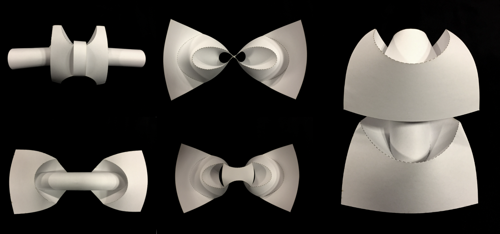

# HuffmanCurvedCreases

This is a software tool for making curved crease patterns based on David Huffman's optical lens based curved crease insights.

Described in some depth in this thesis: https://dspace.mit.edu/handle/1721.1/93013

The tool enables you to manipulate curves in order to design curved crease patterns. It visualizes the rule lines in realtime, following the same path light would take across a parabolic, hyperbolic, or elliptical lens. 

We (Jifei, Amanda, and I) prototyped a few of these designs physically.

My colleague, Amanda Ghassaei, built an amazing oragami simulator alongside this design tool and has continued to improve and evolve it: https://origamisimulator.org/.

